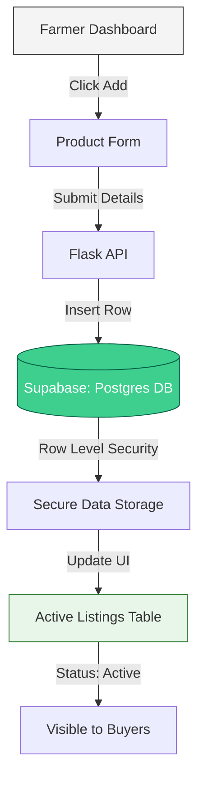

# AgriConnect 🌾
Farmer to Customer marketplace project

## System Architecture

```mermaid
graph TD
    A[Farmer Dashboard] -->|Click Add| B[Product Form]
    B -->|Submit Details| C[Flask API]
    C -->|Insert Row| D[(Supabase: Postgres DB)]
    D -->|Row Level Security| E[Secure Data Storage]
    E -->|Update UI| F[Active Listings Table]
    F -->|Status: Active| G[Visible to Buyers]

    style A fill:#f4f4f4,stroke:#333
    style D fill:#3ecf8e,stroke:#065f46,color:#fff
    style F fill:#e8f5e9,stroke:#2e7d32
```
